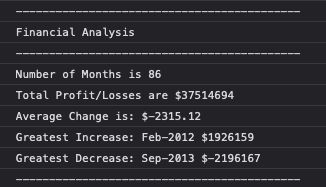

# edX FEND Bootcamp Unit 4 Challenge: Console Finances


## Overview

This activity presents a real-world situation in which we have been tasked with creating code for analyzing the financial records of a company. A financial dataset have been provided in the `starter/index.js` file.


## Enviroment

The code has been written entiraly in JavaScript, the IDE used for the project is Visual Studio Code.


## Expected Outcome 

### Based on the given a dataset composed of arrays with two fields, Date and Profit/Losses, the code must calculate out the below results: 

* The total number of months included in the dataset.

* The net total amount of Profit/Losses over the entire period.

* The average of the **changes** in Profit/Losses over the entire period.

* The greatest increase in Profit/Losses (date and difference in the amounts) over the entire period.

* The greatest decrease in Profit/Losses (date and difference in the amounts) over the entire period.


## End Results

### The javascript code produced the result below:




### Deployment

  ```text
  let avgChange = totalChange / (totalMonths - 1);
  let averageChange = avgChange.toFixed(2);
  ```
Here I had to decrease the decimal number with the .toFixed(n) method as the original result consisted 14 decimal numbers.

---

### Important
Readme is partial, will be fixed later.

---

## Copyright

© 2023 


